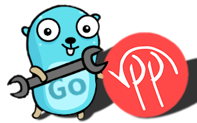

<h1 align="center" style="border-bottom: none">
    <br>GoVPP
</h1>

<p align="center">
	<a href="https://github.com/FDio/govpp/actions/workflows/ci.yaml"></a>
	<a href="https://github.com/FDio/govpp/tags"></a>
	<a href="https://pkg.go.dev/go.fd.io/govpp"></a>
</p>

The GoVPP repository contains Go client libraries, code bindings generator and other toolings for VPP.

Here is brief summary of features provided by GoVPP:

* Generator of Go bindings for VPP API
* Go client library for VPP binary API & Stats API
* Extendable code generator supporting custom plugins
* Pure Go implementation of VPP binary API protocol
* Efficient reader of VPP Stats data from shared memory
* Simple client API that does not rely on VPP API semantics
* Generated RPC client code that handles all boilerplate
* ..and much more!

---

<details><summary>ℹ️ Migration to GitHub</summary>
<p>

## Migration to GitHub

The GoVPP project has been recently migrated to [:octocat: GitHub](https://github.com/FDio/govpp).

### What has changed?

- **Go module path** has changed from ~~`git.fd.io/govpp.git`~~ to `go.fd.io/govpp`.
  - The final release for the old path is [v0.5.0](https://pkg.go.dev/git.fd.io/govpp.git@v0.5.0).
  - The new module can be imported using `go get go.fd.io/govpp@latest`.
- **Repository location** has changed from ~~[Gerrit](https://git.fd.io/govpp.git)~~ to [GitHub](https://github.com/FDio/govpp).
  - The [old Gerrit repository](https://gerrit.fd.io/r/gitweb?p=govpp.git;a=summary) has been archived.

</p>
</details>

## Examples

Here is a list of code examples with short description of demonstrated GoVPP functionality.

- [api-trace](examples/api-trace) - trace sent/received messages
- [binapi-types](examples/binapi-types) - using common types from generated code
- [multi-vpp](examples/multi-vpp) - connect to multiple VPP instances
- [perf-bench](examples/perf-bench) - very basic performance test for measuring throughput
- [rpc-service](examples/rpc-service) - effortless way to call VPP API via RPC client
- [simple-client](examples/simple-client) - send and receive VPP API messages using GoVPP API directly
- [stats-client](examples/stats-client) - client for retrieving VPP stats data
- [stream-client](examples/stream-client) - using new stream API to call VPP API

All code examples can be found under [examples](examples) directory.

## Quick Start

Below are short code samples showing a GoVPP client interacting with the VPP API.

### Using RPC client

Here is a code sample of an effortless way for calling the VPP API by using a generated RPC client.

```go
// Connect to VPP API socket
conn, err := govpp.Connect("/run/vpp/api.sock")
if err != nil {
  // handle err
}
defer conn.Disconnect()

// Init vpe service client
client := vpe.NewServiceClient(conn)

reply, err := client.ShowVersion(context.Background(), &vpe.ShowVersion{})
if err != nil {
  // handle err
}

log.Print("Version: ", reply.Version)
```

Complete example in [rpc-service](examples/rpc-service).

### Using messages directly

Here is a code sample of a low-level way to send/receive messages to/from the VPP by using a Channel.

```go
// Connect to the VPP API socket
conn, err := govpp.Connect("/run/vpp/api.sock")
if err != nil {
	// handle err
}
defer conn.Disconnect()

// Open a new channel
ch, err := conn.NewAPIChannel()
if err != nil {
  // handle err
}
defer ch.Close()

// Prepare messages
req := &vpe.ShowVersion{}
reply := &vpe.ShowVersionReply{}

// Send the request
if err := ch.SendRequest(req).ReceiveReply(reply); err != nil {
	// handle err
}

log.Print("Version: ", reply.Version)
```

For a complete example see [simple-client](examples/simple-client).

### How to contribute?

- Contribute code by submitting a [Pull Request](https://github.com/FDio/govpp/pulls).
- Report bugs by opening an [Issue](https://github.com/FDio/govpp/issues).
- Ask questions & open discussions by starting a [Discussion](https://github.com/FDio/govpp/discussions).

## Documentation

Refer to [User Guide](docs/USER_GUIDE.md) document for all the basics. If you run into issues or just need help debugging read our [Troubleshooting](docs/TROUBLESHOOTING.md) document.

Go reference is available at https://pkg.go.dev/go.fd.io/govpp. More documentation can be found under [docs](docs) directory.

## Repository Structure

Here is a brief overview of the repository structure.

- [govpp](govpp.go) - the entry point for the GoVPP client
  - [adapter](adapter) - VPP binary & stats API interface
    - [mock](adapter/mock) - Mock adapter used for testing
    - [socketclient](adapter/socketclient) - Go implementation of VPP API client for unix socket
    - [statsclient](adapter/statsclient) - Go implementation of VPP Stats client for shared memory
  - [api](api) - GoVPP client API
  - [binapi](binapi) - generated Go bindings for the latest VPP release
  - [binapigen](binapigen) - library for generating code from VPP API
    - [vppapi](binapigen/vppapi) - VPP API parser
  - [cmd](cmd)
    - [binapi-generator](cmd/binapi-generator) - VPP binary API generator
    - [vpp-proxy](cmd/vpp-proxy) - VPP proxy for remote access
  - [codec](codec) - handles encoding/decoding of generated messages into binary form
  - [core](core) - implementation of the GoVPP client
  - [docs](docs) - user & developer documentation
  - [examples](examples) - examples demonstrating GoVPP functionality
  - [proxy](proxy) - contains client/server implementation for proxy
  - [test](test) - integration tests, benchmarks and performance tests
  
